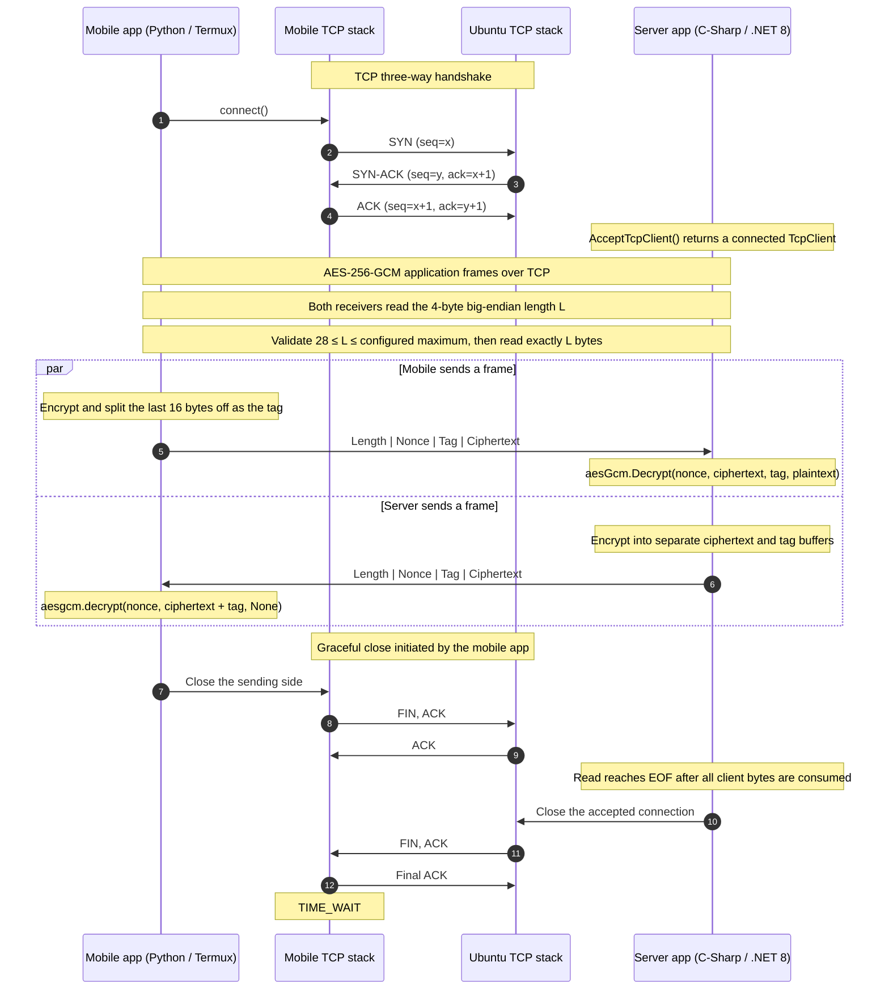

```mermaid
sequenceDiagram
    autonumber
    participant M as Mobile app (Python / Termux)
    participant C as Mobile TCP stack
    participant T as Ubuntu TCP stack
    participant S as Server app (C-Sharp / .NET 8)

    Note over C,T: TCP three-way handshake
    M->>C: connect()
    C->>T: SYN (seq=x)
    T->>C: SYN-ACK (seq=y, ack=x+1)
    C->>T: ACK (seq=x+1, ack=y+1)
    Note over S: AcceptTcpClient() returns a connected TcpClient

    Note over M,S: AES-256-GCM application frames over TCP
    Note over M,S: Both receivers read the 4-byte big-endian length L
    Note over M,S: Validate 28 ≤ L ≤ configured maximum, then read exactly L bytes

    par Mobile sends a frame
        Note over M: Encrypt and split the last 16 bytes off as the tag
        M->>S: Length | Nonce | Tag | Ciphertext
        Note over S: aesGcm.Decrypt(nonce, ciphertext, tag, plaintext)
    and Server sends a frame
        Note over S: Encrypt into separate ciphertext and tag buffers
        S->>M: Length | Nonce | Tag | Ciphertext
        Note over M: aesgcm.decrypt(nonce, ciphertext + tag, None)
    end

    Note over C,T: Graceful close initiated by the mobile app
    M->>C: Close the sending side
    C->>T: FIN, ACK
    T->>C: ACK
    Note over S: Read reaches EOF after all client bytes are consumed
    S->>T: Close the accepted connection
    T->>C: FIN, ACK
    C->>T: Final ACK
    Note over C: TIME_WAIT
```
