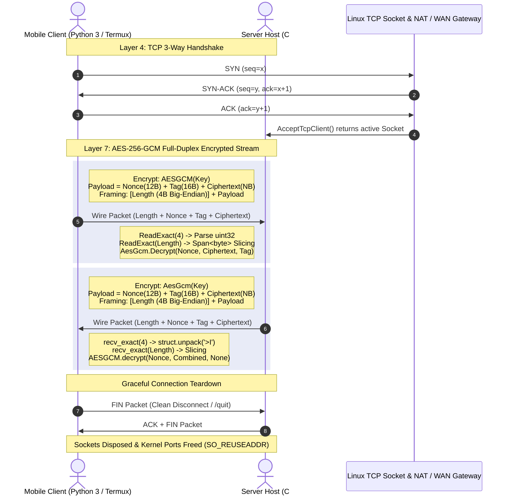

```mermaid
sequenceDiagram
    autonumber
    actor MobileUser as Mobile Client (Python 3 / Termux)
    actor ServerAdmin as Server Host (C# .NET 8 / Ubuntu)
    participant Kernel as Linux TCP Socket & NAT / WAN Gateway

    Note over MobileUser, ServerAdmin: Layer 4: TCP 3-Way Handshake
    MobileUser->>Kernel: SYN (seq=x)
    Kernel->>MobileUser: SYN-ACK (seq=y, ack=x+1)
    MobileUser->>Kernel: ACK (ack=y+1)
    Kernel->>ServerAdmin: AcceptTcpClient() returns active Socket

    Note over MobileUser, ServerAdmin: Layer 7: AES-256-GCM Full-Duplex Encrypted Stream
    rect rgba(100, 120, 200, 0.15)
        Note right of MobileUser: Encrypt: AESGCM(Key)<br/>Payload = Nonce(12B) + Tag(16B) + Ciphertext(NB)<br/>Framing: [Length (4B Big-Endian)] + Payload
        MobileUser->>ServerAdmin: Wire Packet (Length + Nonce + Tag + Ciphertext)
        Note left of ServerAdmin: ReadExact(4) -> Parse uint32<br/>ReadExact(Length) -> Span<byte> Slicing<br/>AesGcm.Decrypt(Nonce, Ciphertext, Tag)
    end

    rect rgba(100, 120, 200, 0.15)
        Note left of ServerAdmin: Encrypt: AesGcm(Key)<br/>Payload = Nonce(12B) + Tag(16B) + Ciphertext(NB)<br/>Framing: [Length (4B Big-Endian)] + Payload
        ServerAdmin->>MobileUser: Wire Packet (Length + Nonce + Tag + Ciphertext)
        Note right of MobileUser: recv_exact(4) -> struct.unpack('>I')<br/>recv_exact(Length) -> Slicing<br/>AESGCM.decrypt(Nonce, Combined, None)
    end

    Note over MobileUser, ServerAdmin: Graceful Connection Teardown
    MobileUser->>ServerAdmin: FIN Packet (Clean Disconnect / /quit)
    ServerAdmin->>MobileUser: ACK + FIN Packet
    Note over MobileUser, ServerAdmin: Sockets Disposed & Kernel Ports Freed (SO_REUSEADDR)
```
